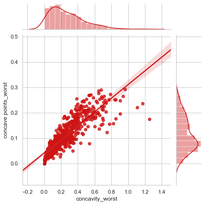
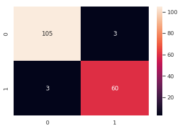
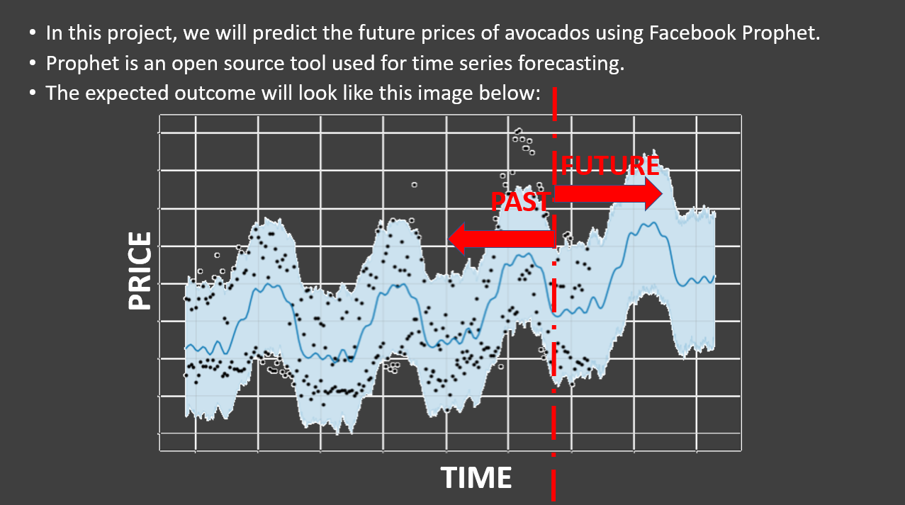

# Linear_Regression 
Predict sales revenue on famous advertising data.

##### Skills applied:
- Cleaning Data
- Exploratory Analysis
- Exploring relationships
- Creating linear regression model(Simple, Multiple)
- Model Evaluation matrics
- Interaction Effect(Synergy)
- Visualize Prediction Error

	</img>

# Exploratory Analysis Using Seaborn
Analyze breast Cancer Diagnostic data.

##### Skills applied:
- Standardizing Data
- Visualizing Standardized Data with Seaborn
- Violin Plots, Box Plots, Swarm Plots, and Joint Plots for Feature Comparison
- Pair-wise Correlations

	</img>

# breast_cancer_clf
Analyse and predict breast Cancer Diagnostic data.

##### Skills applied:
- Visualizing Standardized Data with Seaborn
- EDA
- Classification using XGBoost
- Feature Extraction using Principal Component Analysis

	</img>

# Predict_Future_Product_Prices
Predicting Future Product Prices Using Facebook Prophet¶

	</img>

##### Skills applied:
- EDA
- Develop Model using Facebook Prophet
- Visualize Predictions

# Classification Trees
Heart Disease Prediction 

##### Skills applied:
- Formatting the Data for Decision Trees
- Building a Preliminary Classification Tree
- Cost Complexity Pruning
- Building, Drawing, Interpreting and Evaluating the Final Classification Tree

# Predict_Employee_Turnover
Predict Employee Turnover

##### Skills applied:
- EDA
- Use of Itter-Tools
- Cost Complexity Pruning
- Building, Drawing, Interpreting and Evaluating the Final Classification Tree
